<div align="center">

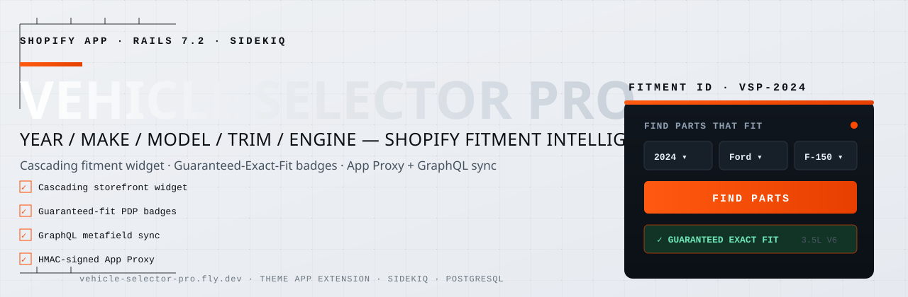

# Vehicle Selector Pro

### Fitment intelligence for Shopify automotive stores

[](https://vehicle-selector-pro.fly.dev/demo)
[](https://vehicle-selector-pro.fly.dev/demo/admin)
[](https://github.com/ai-dev-2024/vehicle-selector-pro/actions/workflows/ci.yml)
[](https://github.com/ai-dev-2024/vehicle-selector-pro)
[](LICENSE)
[](https://rubyonrails.org/)
[](https://ko-fi.com/ai_dev_2024)

</div>

---

Automotive merchants assign **Year / Make / Model / Trim / Engine** fitment data to their products. Customers filter the catalog with cascading dropdowns and see **"Guaranteed Exact Fit"** badges on product pages — powered by Shopify App Proxy, Product Metafields, and a Theme App Extension.

**[Live storefront demo](https://vehicle-selector-pro.fly.dev/demo)** · **[Live admin preview](https://vehicle-selector-pro.fly.dev/demo/admin)** · **[Demo video](#demo)** · **[Setup guide](docs/SETUP.md)** · **[Merchant installation](docs/MERCHANT_INSTALL.md)** · **[Architecture](#architecture)**

<div align="center">

| | | | |
|---|---|---|---|
| **48** YMMTE configurations | **169** verified fitments | **34** mapped products | **8** brands represented |

</div>


> **Installing on your own store** — this is a custom (unlisted) app, so Shopify requires installation through the Partners distribution link. Open an issue or request access and we will generate an install link for your store. The live demo above needs no installation.

---

> **Built entirely with free AI tools.** This project was designed, coded, and documented using no-cost AI assistance end to end — no paid AI models or paid tools were used anywhere in its development. Everything you see was produced with accessible, free tooling, which is why the potential for further growth is so large: with paid, frontier AI models and commercial tooling, this foundation can be extended into a far richer, production-grade solution with ease.
>
> **Built at the ceiling of a consumer notebook.** The entire project — the Rails app, the Shopify wiring, the storefront, the diagrams, this README, and both narrated demo videos — was designed, coded, tested, and rendered on a single machine: an **ASUS ZenBook UX433FA**, a 2018-vintage, **netbook-class consumer laptop** (Intel Core i7-8565U @ 1.80 GHz, 16 GB RAM, Intel UHD 620 integrated graphics — no GPU, no developer workstation, no cloud IDE; every frame of both videos was rendered on the CPU). This is not a developer tool — it is the kind of everyday notebook you would buy for browsing and documents. That ceiling was set by the hardware and free tooling, not by ambition — which is exactly why the headroom is so large, and why the case for allocating proper development hardware (a powerful laptop or workstation with a GPU) is so strong: with the right resources and paid frontier models, the same foundation leaps a level.


---

## Demo

Two narrated walkthroughs — a merchant command-center tour and the shopper experience — cut from the live app against the shop-drawing redesign. Each video has its own distinct voiceover (male for merchants, female for shoppers) and its own music bed, with tight scene pacing — no dead air.

<div align="center">

**▶ The two narrated walkthroughs play inline, right on this page — just press play:**

<video src="https://github.com/user-attachments/assets/8966a45d-d46b-4b19-84c3-0cfe4d6282fa" controls preload="metadata" poster="https://ai-dev-2024.github.io/vehicle-selector-pro/demo/vehicle-selector-merchant-poster.jpg" width="100%"></video>

<sup>**Merchant walkthrough**</sup>

<br>

<video src="https://github.com/user-attachments/assets/545171d8-a8f4-49f8-894b-f82f353bcc1f" controls preload="metadata" poster="https://ai-dev-2024.github.io/vehicle-selector-pro/demo/vehicle-selector-shopper-poster.jpg" width="100%"></video>

<sup>**Shopper walkthrough**</sup>

[Video gallery page](https://ai-dev-2024.github.io/vehicle-selector-pro/demo/videos.html) · [Narration script](docs/DEMO_SCRIPT.md) · [Interactive walkthrough](https://ai-dev-2024.github.io/vehicle-selector-pro/demo/index.html) · [Live storefront demo](https://vehicle-selector-pro.fly.dev/demo)

</div>

---
## Features

- **Cascading storefront widget** — Year, Make, Model, Trim, Engine dropdowns driven by HMAC-signed App Proxy queries
- **Product fitment badges** — Guaranteed Exact Fit / Does NOT Fit / Universal Fit on any product page
- **My Garage** — shoppers save multiple vehicles and switch between them across pages
- **OE part-number search** — shoppers find parts by the factory OE number printed on the part they own
- **Merchant admin** — fitment matrix, vehicle library, bulk CSV import, sync monitor, widget settings
- **Storefront analytics** — daily checks, fit rate, and checks-by-make dashboard (7/30/90-day range) reading async daily aggregates
- **Plans & billing** — Free / Pro / Pro Plus tiers via the Shopify Billing API with 14-day trials; plan ceiling gates bulk imports
- **Metafield sync** — fitment JSON synced to `custom.vehicle_fitment` via `metafieldsSet` in batches of 25 (debounced, resilient)
- **Webhook pipeline** — `products/*`, `app/uninstalled`, `shop/update` processed asynchronously via Sidekiq, replay-protected
- **Production-grade ops** — Solid Cache, ETag caching, structured JSON logging, Sentry, CSP headers, deep health checks, ops runbook
- **Multi-tenant** — per-shop data isolation, encrypted tokens, HMAC-SHA256 verification on every request

---

## Screenshots

### Storefront (live demo)

<div align="center">

**Home — cascading Year / Make / Model / Trim / Engine selector with live fitment data and shop-by-category**

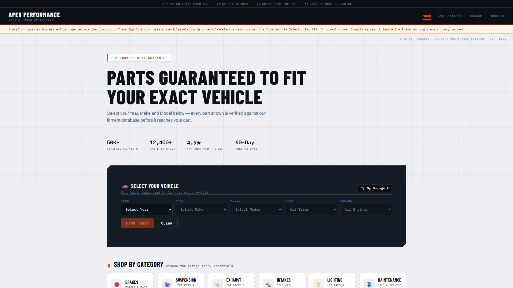

**Vehicle-filtered results — 2023 Ford F-150 with Guaranteed Exact Fit badges**

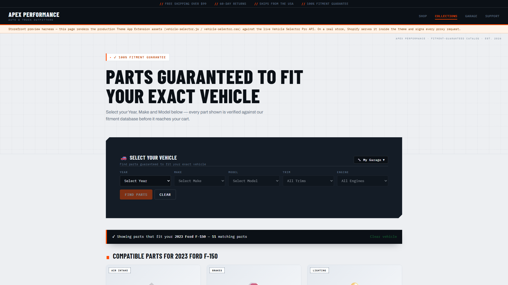

**Product detail — spec sheet, verified-fitment chips, and live fitment badge**

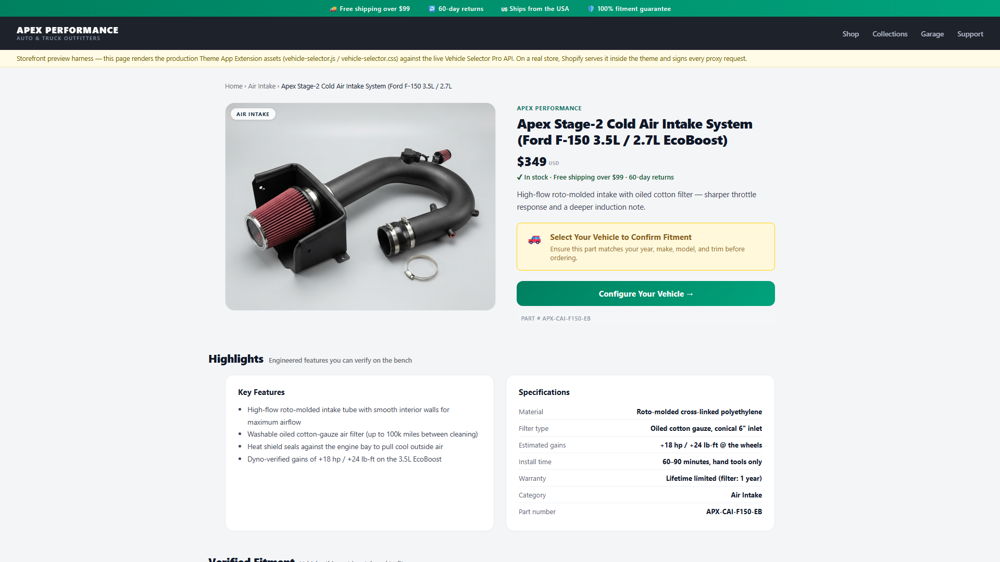

**My Garage — vehicles saved across pages in localStorage**

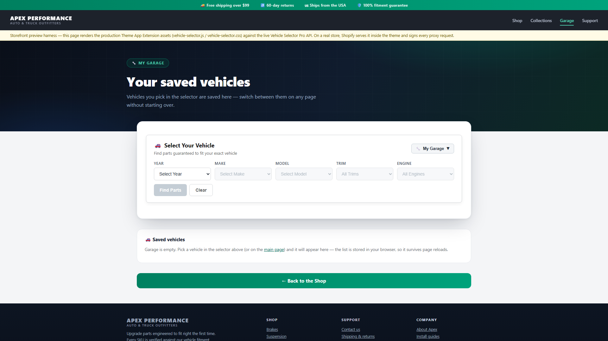

</div>

### Merchant admin (live preview)

<div align="center">

**Dashboard — catalog coverage, mapped products, and live sync status**

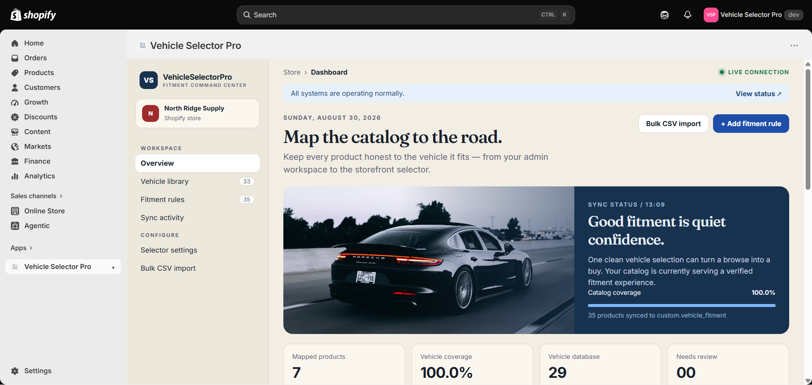

**Vehicle library — the YMMTE database with cascading filters**

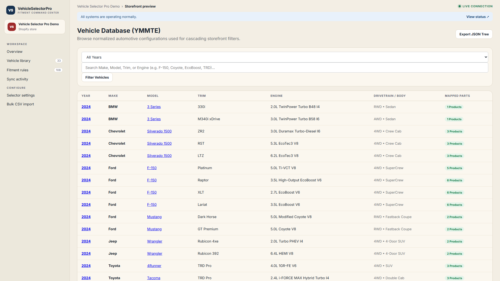

**Product fitment matrix — every product-to-vehicle mapping with sync status**

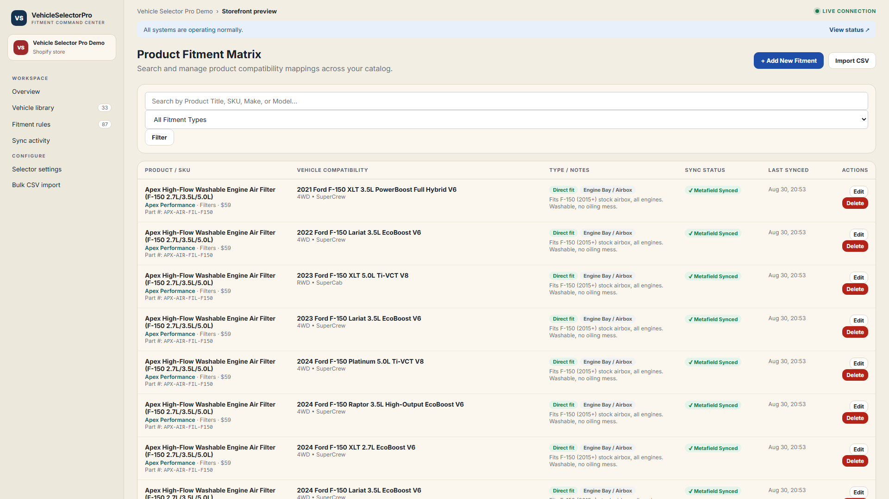

**Widget & Garage configuration**

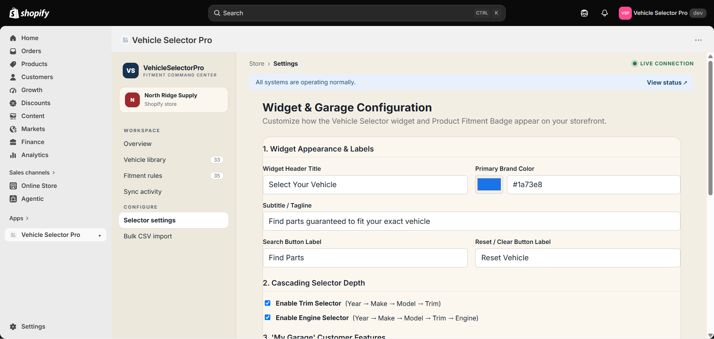

**Bulk CSV import**

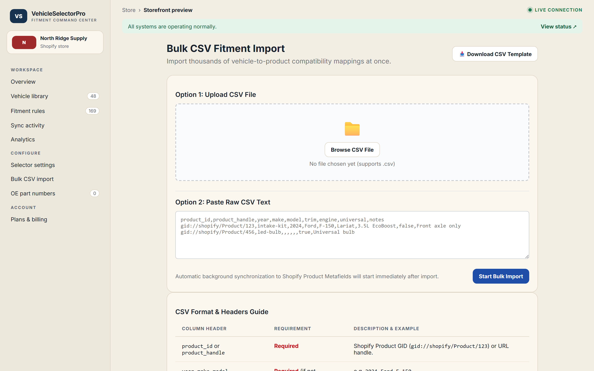

**Metafield sync monitor**

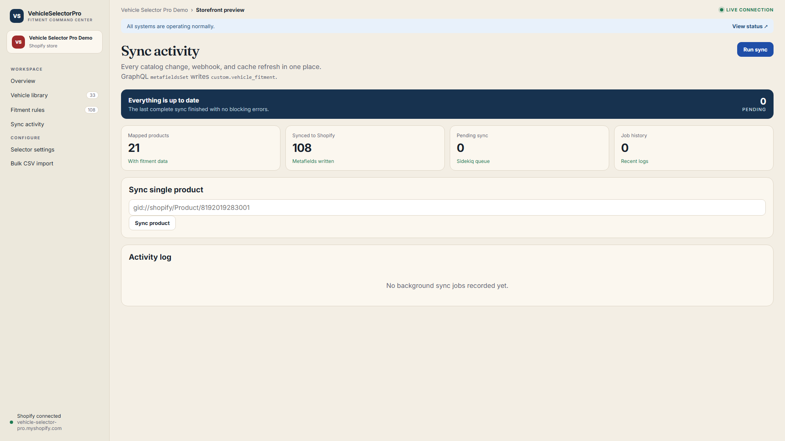

</div>

Every screenshot above is a live capture of the running app — see the **[live storefront demo](https://vehicle-selector-pro.fly.dev/demo)** and the **[live admin preview](https://vehicle-selector-pro.fly.dev/demo/admin)**.

---

## Architecture

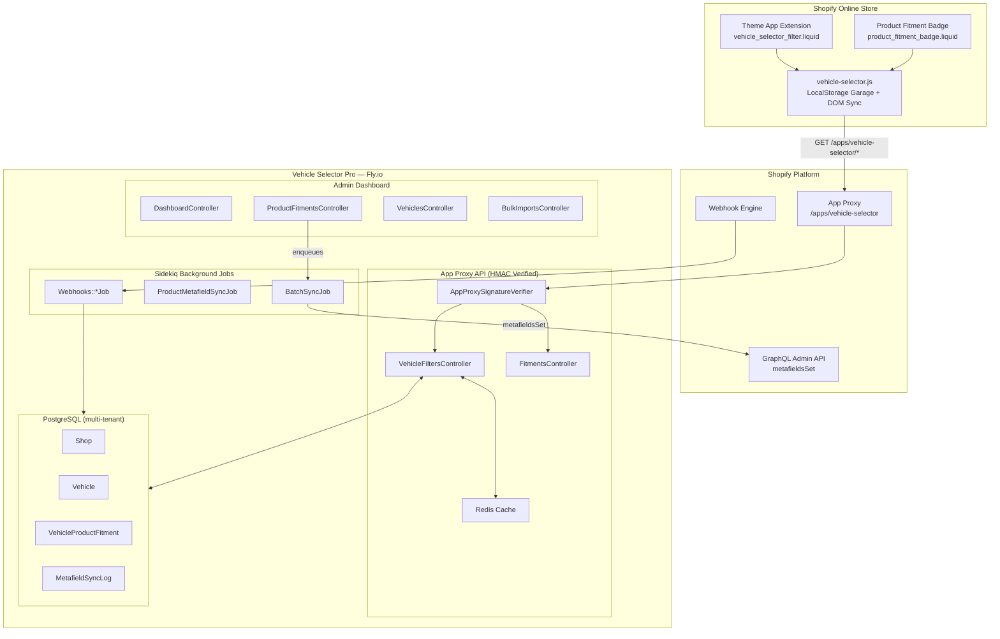

Full system diagrams, data model, and request lifecycles: **[docs/ARCHITECTURE.md](docs/ARCHITECTURE.md)**

---

## Quick start

### Try it now — no install required

**[Live storefront demo →](https://vehicle-selector-pro.fly.dev/demo)** — cascading Year/Make/Model/Trim/Engine widget with guaranteed-fit badges against live data.

**[Live admin preview →](https://vehicle-selector-pro.fly.dev/demo/admin)** — dashboard, fitment matrix ([fitments](https://vehicle-selector-pro.fly.dev/demo/admin/fitments)), vehicle library ([vehicles](https://vehicle-selector-pro.fly.dev/demo/admin/vehicles)), widget settings ([settings](https://vehicle-selector-pro.fly.dev/demo/admin/settings)), bulk CSV import ([imports](https://vehicle-selector-pro.fly.dev/demo/admin/imports)), and the sync monitor ([sync](https://vehicle-selector-pro.fly.dev/demo/admin/sync)).

### Local development

```bash
git clone https://github.com/ai-dev-2024/vehicle-selector-pro.git
cd vehicle-selector-pro
bundle install
cp .env.example .env    # fill in SHOPIFY_API_KEY / SHOPIFY_API_SECRET / SHOPIFY_STORE_DOMAIN
bundle exec rails db:prepare
bundle exec rails db:seed
bundle exec rails server
```

Then open `http://localhost:3000/demo` for the public storefront preview, or `http://localhost:3000/demo/admin` for the read-only admin preview. The legacy `/storefront_preview` route is also available in development.

---

## Tech stack

| Layer | Technology |
|---|---|
| Framework | Ruby on Rails 7.1 |
| Database | PostgreSQL (production) / SQLite (dev) |
| Background jobs | Sidekiq + Redis |
| Shopify integration | Theme App Extension (OS 2.0), App Proxy, GraphQL Admin API (`metafieldsSet`) |
| Security | HMAC-SHA256 verification, Rack::Attack throttling, ActiveRecord Encryption |
| Hosting | Fly.io (Puma + Sidekiq + Postgres + private Redis) |

---

## Roadmap & future development

Shipped as a production-grade foundation, the following are on the roadmap — each is feasible on the current architecture without a rewrite. **Every item sits beyond the original spec's requirement — it is an optional growth path, not part of the agreed scope:**

- **Shopify Billing API** — recurring and one-time plans with managed merchant billing
- **Supersession & OE-number matching** — a richer part-catalog engine with cross-references
- **Fitment confidence scoring** — a smarter universal-vs-exact priority model
- **White-label theming** — storefront theming, translation support, deeper widget controls
- **Merchant analytics** — widget conversion lift, per-fitment demand, and drop-off reports

Because the entire project was built with free AI tooling on a single consumer-class laptop, each of these represents meaningful headroom — the same foundation accelerates dramatically once proper development hardware and paid frontier models are applied.

---

## Documentation

| | |
|---|---|
| [Setup guide](docs/SETUP.md) | Local development environment and public demo routes |
| [Merchant installation](docs/MERCHANT_INSTALL.md) | Safe client handoff, OAuth install and theme setup |
| [Deployment](docs/DEPLOYMENT.md) | Fly.io runbook with provisioning commands |
| [Operations runbook](docs/OPERATIONS.md) | Health checks, backups/restore, monitoring, incidents |
| [API reference](docs/API.md) | App Proxy endpoints, admin endpoints, billing plans, webhook topics |
| [Architecture](docs/ARCHITECTURE.md) | System diagrams and data model (incl. billing, analytics, OE) |
| [Requirements verification](REQUIREMENTS-VERIFICATION.md) | Spec-to-evidence mapping incl. post-spec features |
| [Project structure](PROJECT-STRUCTURE.md) | Directory tree and module map |
| [Privacy policy](docs/PRIVACY.md) | GDPR coverage, data inventory, retention (also served at /privacy) |
| [App Store submission](docs/APP_STORE_SUBMISSION.md) | Partners Dashboard steps, listing copy, review notes |
| [Demo script](docs/DEMO_SCRIPT.md) | Voiceover narration for the walkthrough video |
| [Changelog](CHANGELOG.md) | Release history |

---

## Support

If the demo or the project saved you time or inspired an idea, you can **buy me a coffee** — it fuels more free, open development like this.

<div align="center">

[](https://ko-fi.com/ai_dev_2024)

[**Support the project on Ko-fi →**](https://ko-fi.com/ai_dev_2024) · [**Open a support issue →**](https://github.com/ai-dev-2024/vehicle-selector-pro/issues/new?labels=support&template=blank_issue)

</div>

---

## License & contribution

This project is released under the [MIT License](LICENSE) © 2026 Vehicle Selector Pro contributors.

<div align="center">

[](LICENSE)

[**Read the license →**](LICENSE) · [**Report an issue →**](https://github.com/ai-dev-2024/vehicle-selector-pro/issues/new?labels=bug&template=bug_report.md) · [**Request a feature →**](https://github.com/ai-dev-2024/vehicle-selector-pro/issues/new?labels=enhancement&template=feature_request.md)

</div>
