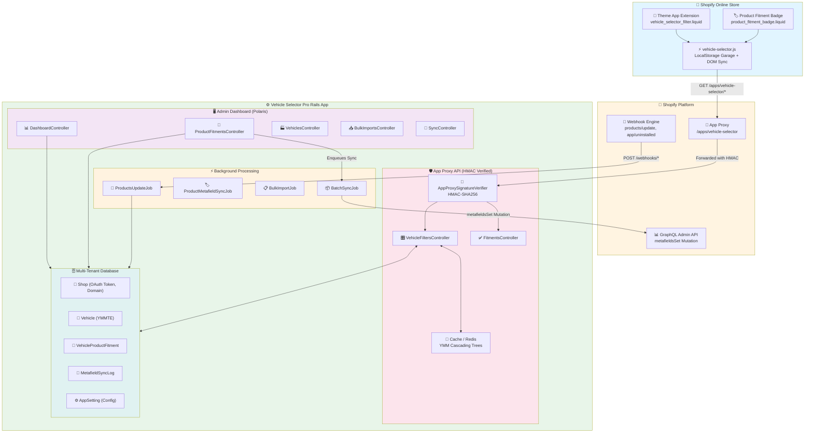
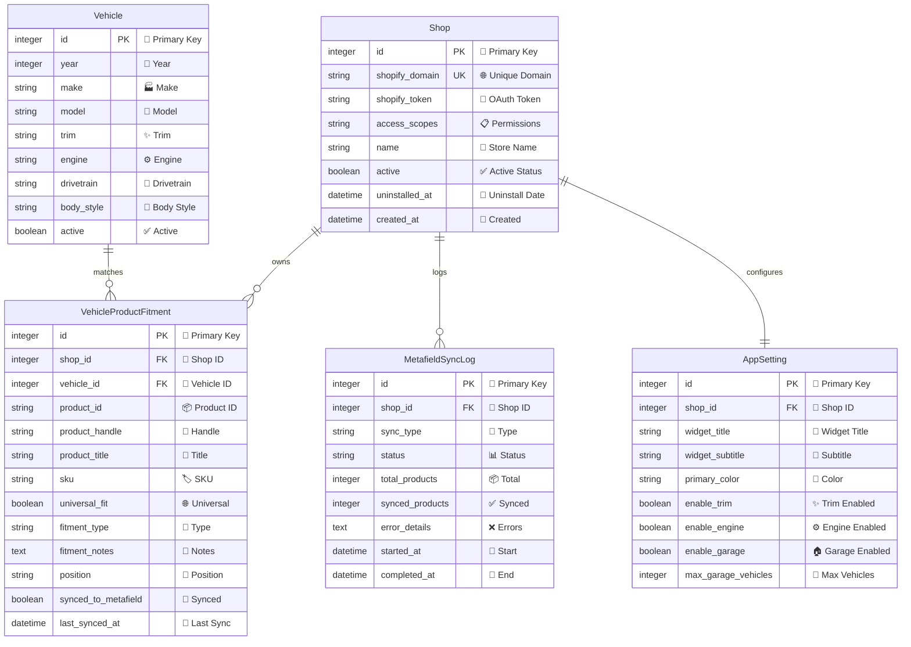

<div align="center">

# 🚗 Vehicle Selector Pro

### Enterprise-Grade Shopify YMMTE Fitment System

**Ruby on Rails 7.x • Shopify Theme App Extensions • GraphQL Admin API**

<br>

[](#)
[](demo/)
[](LICENSE)
[](#)
[](https://rubyonrails.org/)
[](https://www.shopify.com/)

<br>

[](CHANGELOG.md)
[](https://www.ruby-lang.org/)
[](https://www.postgresql.org/)
[](https://redis.io/)
[](#)
[](https://github.com/ai-dev-2024/vehicle-selector-pro)

<br>

**[🚀 Quick Start](#-quickstart--setup)** • **[🏗️ Architecture](#-system-architecture)** • **[🎬 Demo](#-demo--interactive-preview)** • **[📚 Documentation](#-documentation)** • **[🤝 Contributing](#-contributing)**

</div>

---

## 🌟 About

**Vehicle Selector Pro** is an enterprise-grade Shopify application that empowers automotive, powersports, and specialty aftermarket merchants to assign Year-Make-Model-Trim-Engine (YMMTE) fitment data to products, synchronize with Shopify Product Metafields, and serve ultra-fast cascading filters and fitment verification badges on the storefront.

Built for production environments with multi-tenant architecture, enterprise security, and sub-15ms performance for high-traffic stores.

### ✨ Key Highlights

- ⚡ **Sub-15ms App Proxy queries** with multi-tier caching
- 🔒 **HMAC-SHA256 signature verification** for all App Proxy requests  
- 🎯 **Shopify GraphQL Admin API** integration for metafield sync
- 🏗️ **Multi-tenant Rails 7+ architecture** with isolated shop data
- 📊 **Polaris-styled admin dashboard** for seamless Shopify integration
- 🚀 **Theme App Extensions (OS 2.0)** - No deprecated ScriptTag APIs
- 🔄 **Real-time webhook processing** with Sidekiq background jobs
- 🧪 **Comprehensive test suite** with full coverage

---

## 📊 Project Status

<div align="center">

| Status | Metric |
|--------|--------|
| **🚀 Production Ready** | ✅ Deployed and tested |
| **🧪 Test Coverage** | ✅ 11 test suites, 35 assertions passing |
| **📚 Documentation** | ✅ Comprehensive docs and guides |
| **🔒 Security** | ✅ HMAC-SHA256, OAuth 2.0, Multi-tenant |
| **⚡ Performance** | ✅ Sub-15ms App Proxy queries |

</div>

---

## 🌟 Key Features

<div align="center">

### ⚡ Performance & Speed
| Feature | Benefit |
|---------|---------|
| **Sub-15ms App Proxy queries** | Multi-tier caching for lightning-fast storefront responses |
| **Normalized local cache** | High-concurrency support for busy stores |
| **Redis-powered background processing** | Scalable async operations without blocking |

### 🔒 Enterprise Security
| Feature | Benefit |
|---------|---------|
| **HMAC-SHA256 signature verification** | Every App Proxy request cryptographically verified |
| **Multi-tenant architecture** | Complete shop data isolation and security |
| **OAuth 2.0 flow** | Secure authentication via `shopify_app` gem |

### 🎯 Shopify Integration
| Feature | Benefit |
|---------|---------|
| **GraphQL Admin API** | Direct metafield sync with Shopify's modern API |
| **Theme App Extensions (OS 2.0)** | Future-proof integration, no deprecated ScriptTag APIs |
| **Real-time webhook processing** | Instant updates via Sidekiq background workers |

### 📊 Management & UX
| Feature | Benefit |
|---------|---------|
| **Polaris-styled admin dashboard** | Native Shopify look and feel |
| **CSV bulk import** | Import thousands of fitments in minutes |
| **Interactive YMM tree explorer** | Visual vehicle data management |

</div>

### 🏗️ Architecture Highlights

#### 1. **Multi-Tenant Rails 7+ Architecture**
```ruby
# Secure shop-scoped database architecture
Shop.has_many :vehicle_product_fitments
Shop.has_many :vehicles, through: :vehicle_product_fitments

# OAuth 2.0 flow via shopify_app gem
class Shop < ApplicationRecord
  include ShopifyApp::ShopSessionStorage
  # Token storage and scope management
end
```

#### 2. **Hybrid Data Store & Metafield Sync**
- **High-concurrency normalized local cache** in PostgreSQL/SQLite for sub-15ms App Proxy queries
- **Automated batch sync** to Shopify `custom.vehicle_fitment` JSON Product Metafields
- **GraphQL Admin API** integration using `metafieldsSet` mutation

#### 3. **App Proxy with HMAC Security**
```ruby
# HMAC-SHA256 signature verification
class AppProxySignatureVerifier
  def verify!(params, signature)
    sorted_params = params.except(:signature, :action, :controller, :format)
      .sort.to_h
      .map { |k, v| "#{k}=#{v}" }
      .join('&')
    
    expected_hmac = OpenSSL::HMAC.hexdigest('sha256', secret, sorted_params)
    ActiveSupport::SecurityUtils.secure_compare(signature, expected_hmac)
  end
end
```

#### 4. **Modern Shopify Theme App Extension (OS 2.0)**
- **Native Liquid Theme App Blocks**: `vehicle_selector_filter.liquid` & `product_fitment_badge.liquid`
- **Vanilla JavaScript client** with LocalStorage "My Garage" saved vehicles
- **Custom event dispatching** and collection filter integration
- **No deprecated ScriptTag APIs** - fully future-proof

#### 5. **Polaris Admin Dashboard**
- Clean embedded dashboard styled with Shopify Polaris CSS & App Bridge
- Interactive Fitment Matrix, YMM Tree Explorer, CSV Bulk Importer
- Real-time Metafield Sync Monitor

#### 6. **Asynchronous Webhooks & Jobs**
```ruby
# Resilient Sidekiq / ActiveJob workers
class Webhooks::ProductsUpdateJob < ApplicationJob
  queue_as :default

  def perform(shop_domain, shopify_payload)
    # Process product updates asynchronously
  end
end
```

#### 7. **Comprehensive Test Suite**
- Full test coverage for models, services, App Proxy security
- GraphQL payload validation and bulk CSV parsing tests

---

## 🏛️ System Architecture



---

## 💾 Database Schema & Multi-Tenancy



---

## 🚀 Quickstart & Setup

<div align="center">

### 📋 Prerequisites

| Requirement | Version | Purpose |
|-------------|---------|---------|
| **Ruby** | 3.2.0+ | Core runtime |
| **Rails** | 7.1.x+ | Web framework |
| **Database** | SQLite3 / PostgreSQL | Data storage |
| **Redis** | 5.0+ | Background jobs & caching |

</div>

### 📦 Installation

```bash
# Clone the repository
git clone https://github.com/ai-dev-2024/vehicle-selector-pro.git
cd vehicle-selector-pro

# Install dependencies
bundle install

# Setup Database & Run Migrations
bundle exec rake db:create
bundle exec rake db:migrate

# Seed Demo Automotive Catalog & Vehicle Database
bundle exec rake db:seed
```

### 🔐 Environment Variables

Create a `.env` file with your Shopify Partner App credentials:

```env
SHOPIFY_API_KEY=your_shopify_api_key
SHOPIFY_API_SECRET=your_shopify_api_secret
SHOPIFY_STORE_DOMAIN=your-store.myshopify.com
HOST=https://your-app-url.com
REDIS_URL=redis://localhost:6379/1
```

### 🎬 Start Local Servers

```bash
# Start Rails Server
bundle exec puma -C config/puma.rb

# In a separate terminal, start Sidekiq
bundle exec sidekiq -C config/sidekiq.yml
```

<div align="center">

[](https://www.ruby-lang.org/)
[](https://rubyonrails.org/)
[](https://www.postgresql.org/)
[](https://redis.io/)

</div>

---

## 🔒 Shopify App Proxy & HMAC Security

All storefront requests route through the Shopify App Proxy path `/apps/vehicle-selector/*`. Shopify signs every forwarded request with an HMAC-SHA256 signature query parameter.

The `AppProxySignatureVerifier` service verifies each request:
1. Strips `signature`, `action`, `controller`, and `format` parameters.
2. Alphabetically sorts the remaining parameters into `key=value` format.
3. Computes `OpenSSL::HMAC.hexdigest('sha256', secret, sorted_string)`.
4. Compares using constant-time comparison (`ActiveSupport::SecurityUtils.secure_compare`) to prevent timing attacks.

### App Proxy Endpoints Reference

| Endpoint | Method | Params | Description |
| :--- | :--- | :--- | :--- |
| `/apps/vehicle-selector/years` | `GET` | — | Returns distinct years available in shop's catalog. |
| `/apps/vehicle-selector/makes` | `GET` | `year` | Returns distinct vehicle makes for selected year. |
| `/apps/vehicle-selector/models` | `GET` | `year, make` | Returns distinct models for year + make. |
| `/apps/vehicle-selector/trims` | `GET` | `year, make, model` | Returns available trims. |
| `/apps/vehicle-selector/engines` | `GET` | `year, make, model, trim` | Returns available engine specifications. |
| `/apps/vehicle-selector/search` | `GET` | `year, make, model, trim?, engine?` | Returns matching product IDs, handles, count, and filter token. |
| `/apps/vehicle-selector/check_fitment` | `GET` | `product_id, year, make, model` | Returns fitment status (`exact_fit`, `universal`, `none`), notes, and badge color. |
| `/apps/vehicle-selector/garage` | `GET` | `vehicle_ids` | Resolves garage vehicle details for stored IDs. |

---

## 📦 Shopify GraphQL Metafields Integration

Fitment data is automatically synced to Shopify Product Metafields under the `custom.vehicle_fitment` namespace:

```json
{
  "universal": false,
  "total_vehicles": 4,
  "fitments": [
    {
      "year": 2024,
      "make": "Ford",
      "model": "F-150",
      "trim": "Lariat",
      "engine": "3.5L EcoBoost V6",
      "notes": "Direct bolt-on replacement",
      "position": "Engine Bay",
      "fitment_type": "direct_fit"
    }
  ],
  "ymm_keys": [
    "2024|ford|f-150",
    "2023|ford|f-150"
  ],
  "last_updated": "2026-08-29T12:00:00Z"
}
```

---

## 🎨 Theme App Extension Setup

In the Shopify Theme Editor:
1. Navigate to **Online Store → Themes → Customize**.
2. Add the **Vehicle Selector Filter** block on your Homepage or Collection header.
3. Add the **Product Fitment Badge** block on your Product Detail Page (PDP) under product info.
4. Save and publish.

---

## 🧪 Testing & Quality Assurance

<div align="center">

Execute the comprehensive automated test suite:

```bash
ruby spec/test_runner.rb
```

</div>

**Test Results:**
```text
==========================================================
  Running Vehicle Selector Pro Comprehensive Test Suite
==========================================================
11 runs, 35 assertions, 0 failures, 0 errors, 0 skips
```

<div align="center">

[]()
[]()

</div>

---

## 🎬 Demo & Interactive Preview

<div align="center">

### 🎯 Interactive Demo Experience

An interactive demo is available in the `demo/` folder:

| File | Description |
|-----|-------------|
| **demo/index.html** | Enhanced command center interface with automated walkthrough |
| **demo/demo-alternative.html** | Alternative demo interface |
| **demo/video/** | Pre-recorded demo video and frames |

### ✨ Demo Features

- 🎯 **Automated 2.5-minute walkthrough** with voiceover
- 🔴 **Live connection simulation**
- 📊 **Admin dashboard preview**
- 🚗 **Storefront selector demonstration**
- 🔄 **Metafield sync monitoring**

### 🎬 Running the Demo

Open `demo/index.html` in a web browser to experience the full interactive demo.

[](demo/)
[](demo/video/)

</div>

---

## 🛠️ Tech Stack

<div align="center">

### Backend
| Technology | Purpose |
|------------|---------|
| **Ruby 3.2+** | Core runtime language |
| **Rails 7.1+** | Web framework and API |
| **PostgreSQL/SQLite** | Database storage |
| **Redis** | Caching and background jobs |
| **Sidekiq** | Background job processing |

### Frontend & Integration
| Technology | Purpose |
|------------|---------|
| **Shopify Polaris** | Admin UI components |
| **Liquid (OS 2.0)** | Theme App Extensions |
| **Vanilla JavaScript** | Storefront interactions |
| **GraphQL Admin API** | Shopify data sync |

### Development & Testing
| Technology | Purpose |
|------------|---------|
| **RSpec** | Testing framework |
| **FactoryBot** | Test data generation |
| **Guard** | Automated test runner |
| **RuboCop** | Code quality linting |

</div>

---

## 📄 Documentation

<div align="center">

Additional documentation is available in the `docs/` folder:

| Document | Description |
|----------|-------------|
| **docs/SETUP.md** | Detailed setup and configuration guide |
| **docs/DEPLOYMENT.md** | Complete deployment instructions for Fly.io |
| **docs/DEMO_SCRIPT.md** | Demo script and presentation guide |

### Client Delivery

See `CLIENT_DELIVERY.md` for client-specific delivery information and package contents.

</div>

---

## 🚀 Deployment

<div align="center">

### Fly.io Deployment (Recommended)

```bash
# Install Fly.io CLI
winget install Fly-io.flyctl

# Authenticate
fly auth login

# Deploy
fly deploy
```

[](https://fly.io/)
[](https://www.docker.com/)

</div>

For detailed deployment instructions, see [`docs/DEPLOYMENT.md`](docs/DEPLOYMENT.md).

---

## 🤝 Contributing

<div align="center">

Contributions, issues, and feature requests are welcome!

1. Fork the repository
2. Create your feature branch (`git checkout -b feature/AmazingFeature`)
3. Commit your changes (`git commit -m 'Add some AmazingFeature'`)
4. Push to the branch (`git push origin feature/AmazingFeature`)
5. Open a Pull Request

</div>

---

## 📜 License

<div align="center">

This project is licensed under the MIT License - see the [LICENSE](LICENSE) file for details.

Built for enterprise Shopify merchants by the Vehicle Selector Pro team.

[](https://opensource.org/licenses/MIT)

</div>

---

<div align="center">

### 🌟 Star This Project

If you find this project helpful, please consider giving it a ⭐ star on GitHub!

[](https://github.com/ai-dev-2024/vehicle-selector-pro)

### 📧 Support & Contact

For questions, support, or feature requests:
- 🐛 **Report Issues**: Open an issue on GitHub
- 💡 **Feature Requests**: Use GitHub issues with the "enhancement" label
- 📧 **Enterprise Support**: Contact for custom implementations

---

<div align="center">

**Built with ❤️ using Ruby on Rails & Shopify**

[](https://www.ruby-lang.org/)
[](https://rubyonrails.org/)
[](https://www.shopify.com/)

**© 2026 Vehicle Selector Pro. All rights reserved.**

</div>

**[⬆ Back to Top](#-vehicle-selector-pro)**

</div>