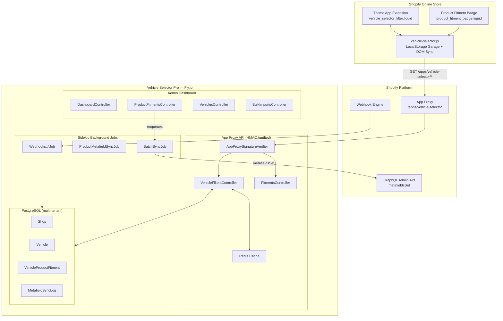

<div align="center">


# Vehicle Selector Pro

### Fitment intelligence for Shopify automotive stores

[](https://vehicle-selector-pro.fly.dev/demo)
[](https://vehicle-selector-pro.fly.dev/demo/admin)
[](https://github.com/ai-dev-2024/vehicle-selector-pro)
[](LICENSE)
[](https://rubyonrails.org/)

</div>

---

Automotive merchants assign **Year / Make / Model / Trim / Engine** fitment data to their products. Customers filter the catalog with cascading dropdowns and see **"Guaranteed Exact Fit"** badges on product pages — powered by Shopify App Proxy, Product Metafields, and a Theme App Extension.

**[Live storefront demo](https://vehicle-selector-pro.fly.dev/demo)** · **[Live admin preview](https://vehicle-selector-pro.fly.dev/demo/admin)** · **[Demo video](#demo)** · **[Setup guide](docs/SETUP.md)** · **[Architecture](#architecture)**

> **Installing on your own store** — this is a custom (unlisted) app, so Shopify requires installation through the Partners distribution link. Open an issue or request access and we will generate an install link for your store. The live demo above needs no installation.

---

## Demo

<div align="center">

<video src="demo/Vehicle_Selector_Pro_Demo_v3.mp4" controls width="100%" poster="docs/assets/screenshot-hero.png">
  Your browser does not support the video tag — <a href="demo/Vehicle_Selector_Pro_Demo_v3.mp4">download the .mp4</a>.
</video>

**[▶ Watch the 2.5-minute walkthrough](demo/Vehicle_Selector_Pro_Demo_v3.mp4)** — real screen recording of the working app with studio AI voiceover and background score · [script](docs/DEMO_SCRIPT.md) · [interactive walkthrough](demo/index.html)

</div>

---

## Features

- **Cascading storefront widget** — Year, Make, Model, Trim, Engine dropdowns driven by HMAC-signed App Proxy queries
- **Product fitment badges** — Guaranteed Exact Fit / Does NOT Fit / Universal Fit on any product page
- **My Garage** — shoppers save multiple vehicles and switch between them across pages
- **Merchant admin** — fitment matrix, vehicle library, bulk CSV import, sync monitor, widget settings
- **Metafield sync** — fitment JSON synced to `custom.vehicle_fitment` via `metafieldsSet` in batches of 25
- **Webhook pipeline** — `products/*`, `app/uninstalled`, `shop/update` processed asynchronously via Sidekiq
- **Multi-tenant** — per-shop data isolation, encrypted tokens, HMAC-SHA256 verification on every request

---

## Screenshots

### Storefront (live demo)

<div align="center">

**Home — cascading Year / Make / Model / Trim / Engine widget with shop-by-category and featured parts**


**Vehicle-filtered results — 2023 Ford F-150 with Guaranteed Exact Fit badges**


**Product detail — spec sheet, verified-fitment chips, and live fitment badge**


**My Garage — vehicles saved across pages in localStorage**


</div>

### Merchant admin (live preview)

<div align="center">

**Dashboard — catalog coverage, mapped products, and live sync status**


**Vehicle library — the YMMTE database with cascading filters**


**Product fitment matrix — every product-to-vehicle mapping with sync status**


**Widget & Garage configuration**


**Bulk CSV import**


**Metafield sync monitor**


</div>

Every screenshot above is a live capture of the running app — see the **[live storefront demo](https://vehicle-selector-pro.fly.dev/demo)** and the **[live admin preview](https://vehicle-selector-pro.fly.dev/demo/admin)**.

---

## Architecture



Full system diagrams, data model, and request lifecycles: **[docs/ARCHITECTURE.md](docs/ARCHITECTURE.md)**

---

## Quick start

### Try it now — no install required

**[Live storefront demo →](https://vehicle-selector-pro.fly.dev/demo)** — cascading Year/Make/Model/Trim/Engine widget with guaranteed-fit badges against live data.

**[Live admin preview →](https://vehicle-selector-pro.fly.dev/demo/admin)** — dashboard, fitment matrix ([fitments](https://vehicle-selector-pro.fly.dev/demo/admin/fitments)), vehicle library ([vehicles](https://vehicle-selector-pro.fly.dev/demo/admin/vehicles)), widget settings ([settings](https://vehicle-selector-pro.fly.dev/demo/admin/settings)), bulk CSV import ([imports](https://vehicle-selector-pro.fly.dev/demo/admin/imports)), and the sync monitor ([sync](https://vehicle-selector-pro.fly.dev/demo/admin/sync)).

### Local development

```bash
git clone https://github.com/ai-dev-2024/vehicle-selector-pro.git
cd vehicle-selector-pro
bundle install
cp .env.example .env    # fill in SHOPIFY_API_KEY / SHOPIFY_API_SECRET / SHOPIFY_STORE_DOMAIN
bundle exec rails db:prepare db:seed
bundle exec rails server
```

Then open `http://localhost:3000` for the admin dashboard, or `http://localhost:3000/storefront_preview` to see the Theme App Extension widget against live data.

---

## Tech stack

| Layer | Technology |
|---|---|
| Framework | Ruby on Rails 7.1 |
| Database | PostgreSQL (production) / SQLite (dev) |
| Background jobs | Sidekiq + Redis |
| Shopify integration | Theme App Extension (OS 2.0), App Proxy, GraphQL Admin API (`metafieldsSet`) |
| Security | HMAC-SHA256 verification, Rack::Attack throttling, ActiveRecord Encryption |
| Hosting | Fly.io (Puma + Sidekiq + Postgres + private Redis) |

---

## Documentation

| | |
|---|---|
| [Setup guide](docs/SETUP.md) | Local development environment |
| [Deployment](docs/DEPLOYMENT.md) | Fly.io runbook with provisioning commands |
| [API reference](docs/API.md) | App Proxy endpoints and webhook topics |
| [Architecture](docs/ARCHITECTURE.md) | System diagrams and data model |
| [Demo script](docs/DEMO_SCRIPT.md) | Voiceover narration for the walkthrough video |
| [Changelog](CHANGELOG.md) | Release history |

---

## License

[MIT](LICENSE) © 2026 Vehicle Selector Pro contributors.

<div align="center">

[Report an issue](https://github.com/ai-dev-2024/vehicle-selector-pro/issues) · [Request a feature](https://github.com/ai-dev-2024/vehicle-selector-pro/issues/new)

</div>
