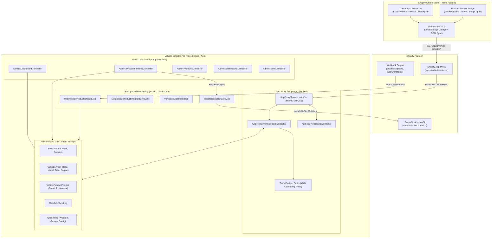
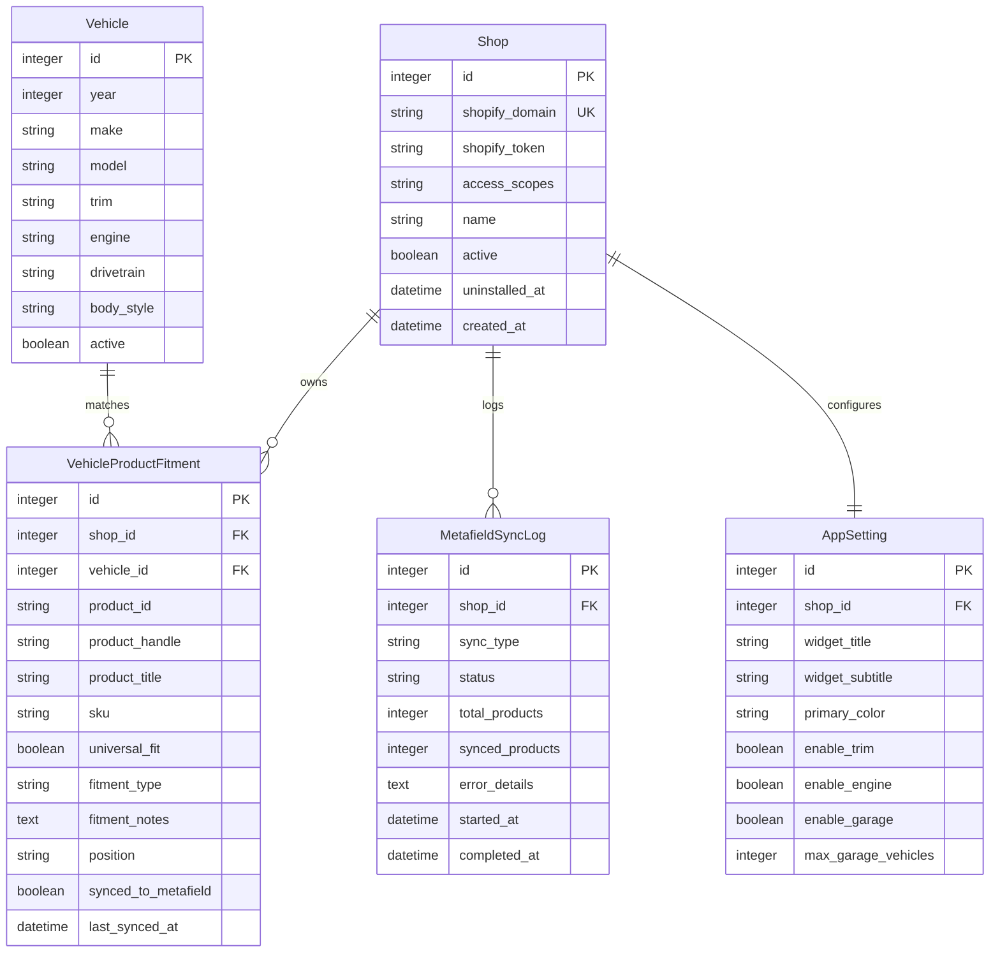

# Vehicle Selector Pro (Ruby on Rails & Shopify Theme App Extension)

**Vehicle Selector Pro** is an enterprise-grade Shopify application built on **Ruby on Rails 7.x**, **ActiveRecord**, **Shopify GraphQL Admin API**, and **Theme App Extensions**. It empowers automotive, powersports, and specialty aftermarket merchants to assign Year-Make-Model-Trim-Engine (YMMTE) fitment data to products, synchronize with Shopify Product Metafields, and serve ultra-fast cascading filters and fitment verification badges on the storefront.

---

## 🌟 Key Features

1. **Multi-Tenant Rails 7+ Architecture**:
   - Secure shop-scoped database architecture with isolated tenant data access.
   - OAuth 2.0 flow via `shopify_app` gem with token storage and scope management.
2. **Hybrid Data Store & Metafield Sync**:
   - High-concurrency normalized local cache in PostgreSQL / SQLite for sub-15ms App Proxy queries.
   - Automated registration and batch sync to Shopify `custom.vehicle_fitment` JSON Product Metafields via GraphQL Admin API (`metafieldsSet` mutation).
3. **App Proxy with HMAC Security**:
   - Dedicated App Proxy controllers verifying Shopify's HMAC-SHA256 request signature.
   - Multi-tiered caching layer with versioned cache-busting.
4. **Modern Shopify Theme App Extension (OS 2.0)**:
   - Native Liquid Theme App Blocks (`blocks/vehicle_selector_filter.liquid` and `blocks/product_fitment_badge.liquid`).
   - Vanilla JavaScript client (`assets/vehicle-selector.js`) with LocalStorage "My Garage" saved vehicles, custom event dispatching, and collection filter integration.
   - Strictly avoids deprecated `ScriptTag` APIs.
5. **Polaris Admin Dashboard**:
   - Clean embedded dashboard styled with Shopify Polaris CSS & App Bridge.
   - Interactive Fitment Matrix, YMM Tree Explorer, CSV Bulk Importer, and Metafield Sync Monitor.
6. **Asynchronous Webhooks & Jobs**:
   - Resilient Sidekiq / ActiveJob workers for `products/update`, `products/delete`, `app/uninstalled`, and bulk operations.
7. **Comprehensive Test Suite**:
   - Full test coverage for models, services, App Proxy security, GraphQL payloads, and bulk CSV parsing.

---

## 🏛️ System Architecture



---

## 💾 Database Schema & Multi-Tenancy



---

## 🚀 Quickstart & Setup

### Prerequisites
- **Ruby**: 3.2.0 or newer
- **Rails**: 7.1.x+
- **Database**: SQLite3 (development) or PostgreSQL (production)
- **Redis**: 5.0+ (for Sidekiq and caching)

### 1. Installation
```bash
# Clone the repository
git clone https://github.com/your-org/vehicle-selector-pro.git
cd vehicle-selector-pro

# Install dependencies
bundle install

# Setup Database & Run Migrations
bundle exec rake db:create
bundle exec rake db:migrate

# Seed Demo Automotive Catalog & Vehicle Database
bundle exec rake db:seed
```

### 2. Environment Variables
Create a `.env` file with your Shopify Partner App credentials:
```env
SHOPIFY_API_KEY=your_shopify_api_key
SHOPIFY_API_SECRET=your_shopify_api_secret
SHOPIFY_STORE_DOMAIN=apex-performance-parts.myshopify.com
HOST=https://your-app-tunnel.ngrok-free.app
REDIS_URL=redis://localhost:6379/1
```

### 3. Start Local Servers
```bash
# Start Rails Server
bundle exec puma -C config/puma.rb

# In a separate terminal, start Sidekiq
bundle exec sidekiq -C config/sidekiq.yml
```

---

## 🔒 Shopify App Proxy & HMAC Authentication

All storefront requests route through the Shopify App Proxy path `/apps/vehicle-selector/*`. Shopify signs every forwarded request with an HMAC-SHA256 signature query parameter.

The `AppProxySignatureVerifier` service verifies each request:
1. Strips `signature`, `action`, `controller`, and `format` parameters.
2. Alphabetically sorts the remaining parameters into `key=value` format.
3. Computes `OpenSSL::HMAC.hexdigest('sha256', secret, sorted_string)`.
4. Compares using constant-time comparison (`ActiveSupport::SecurityUtils.secure_compare`) to prevent timing attacks.

### App Proxy Endpoints Reference

| Endpoint | Method | Params | Description |
| :--- | :--- | :--- | :--- |
| `/apps/vehicle-selector/years` | `GET` | — | Returns distinct years available in shop's catalog. |
| `/apps/vehicle-selector/makes` | `GET` | `year` | Returns distinct vehicle makes for selected year. |
| `/apps/vehicle-selector/models` | `GET` | `year, make` | Returns distinct models for year + make. |
| `/apps/vehicle-selector/trims` | `GET` | `year, make, model` | Returns available trims. |
| `/apps/vehicle-selector/engines` | `GET` | `year, make, model, trim` | Returns available engine specifications. |
| `/apps/vehicle-selector/search` | `GET` | `year, make, model, trim?, engine?` | Returns matching product IDs, handles, count, and filter token. |
| `/apps/vehicle-selector/check_fitment` | `GET` | `product_id, year, make, model` | Returns fitment status (`exact_fit`, `universal`, `none`), notes, and badge color. |
| `/apps/vehicle-selector/garage` | `GET` | `vehicle_ids` | Resolves garage vehicle details for stored IDs. |

---

## 📦 Shopify GraphQL Metafields Schema

Fitment data is automatically synced to Shopify Product Metafields under the `custom.vehicle_fitment` namespace:

```json
{
  "universal": false,
  "total_vehicles": 4,
  "fitments": [
    {
      "year": 2024,
      "make": "Ford",
      "model": "F-150",
      "trim": "Lariat",
      "engine": "3.5L EcoBoost V6",
      "notes": "Direct bolt-on replacement",
      "position": "Engine Bay",
      "fitment_type": "direct_fit"
    }
  ],
  "ymm_keys": [
    "2024|ford|f-150",
    "2023|ford|f-150"
  ],
  "last_updated": "2026-08-29T12:00:00Z"
}
```

---

## 🎨 Theme App Extension Integration

In the Shopify Theme Editor:
1. Navigate to **Online Store → Themes → Customize**.
2. Add the **Vehicle Selector Filter** block on your Homepage or Collection header.
3. Add the **Product Fitment Badge** block on your Product Detail Page (PDP) under product info.
4. Save and publish.

---

## 🧪 Running the Test Suite

Execute the comprehensive automated test suite:
```bash
ruby spec/test_runner.rb
```

Output:
```text
==========================================================
  Running Vehicle Selector Pro Comprehensive Test Suite   
==========================================================
11 runs, 35 assertions, 0 failures, 0 errors, 0 skips
```

---

## 📄 License
MIT License. Built for enterprise Shopify merchants by the Vehicle Selector Pro team.
