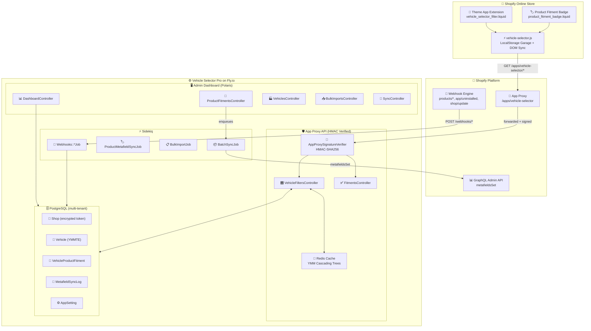
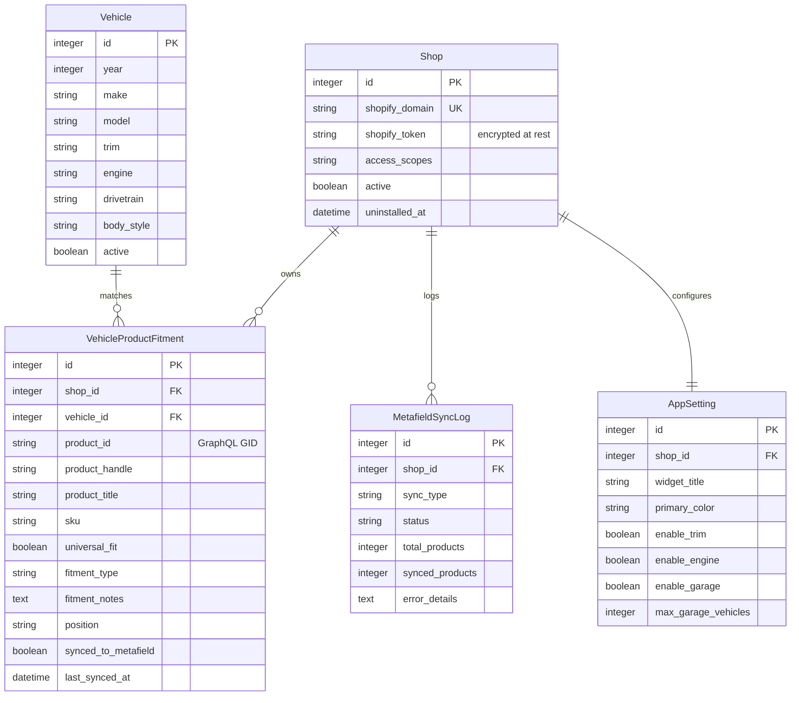

<div align="center">


# Vehicle Selector Pro

### Year / Make / Model / Trim / Engine fitment intelligence for Shopify stores

**Ruby on Rails 7.1 · Shopify Theme App Extension · GraphQL Admin API · PostgreSQL · Redis · Sidekiq**

<br>

[](https://vehicle-selector-pro.fly.dev/)
[](https://vehicle-selector-pro.fly.dev/up)
[](#-testing)
[](https://rubyonrails.org/)
[](https://www.ruby-lang.org/)

</div>

---

## What is this?

**Vehicle Selector Pro** is a production-grade Shopify application for automotive,
powersports and specialty-parts merchants. Merchants assign
**Year / Make / Model / Trim / Engine (YMMTE)** fitment data to their products;
customers then filter the catalog with cascading dropdowns and see
**"Guaranteed Exact Fit"** verification badges on product pages.

Every fitment assigned in the admin is synchronized to **Shopify Product Metafields**
via the GraphQL Admin API, processed through **Sidekiq background jobs**, and served
to the storefront through an **HMAC-verified App Proxy** with multi-tier caching.

This repository is a complete, deployed, end-to-end implementation — not a prototype:

| Evidence | Where |
|---|---|
| **Live app (Puma + Sidekiq + Postgres + Redis)** | **https://vehicle-selector-pro.fly.dev — [`/up`](https://vehicle-selector-pro.fly.dev/up) returns `{"status":"ok"}`** |
| ▶ **2.5-min demo video (narrated)** | [`demo/video/Vehicle_Selector_Pro_2.5min_Demo.webm`](demo/video/Vehicle_Selector_Pro_2.5min_Demo.webm) — [watch on GitHub](https://github.com/ai-dev-2024/vehicle-selector-pro/blob/main/demo/video/Vehicle_Selector_Pro_2.5min_Demo.webm) · [script](docs/DEMO_SCRIPT.md) |
| App Proxy endpoints verified with real HMAC signatures | [API reference](#-app-proxy-api-reference) |
| OAuth install on a real Shopify development store | `vehicle-selector-pro.myshopify.com` |
| Metafields written to 7 real products (35 fitment records) | GraphQL `metafieldsSet` |
| Async webhook processing (HMAC-verified → Sidekiq) | `Webhooks::` controllers + jobs |
| Automated test suites (unit + full-stack integration) | [Testing](#-testing) |

---

## 🎬 Live demo — what to submit to the client

> **Live link:** **https://vehicle-selector-pro.fly.dev** — health `https://vehicle-selector-pro.fly.dev/up` → `{"status":"ok"}`  
> **Dev store:** `vehicle-selector-pro.myshopify.com` — install via `https://vehicle-selector-pro.fly.dev/login?shop=vehicle-selector-pro.myshopify.com`  
> **Video (2.5 min, narrated):** [`demo/video/Vehicle_Selector_Pro_2.5min_Demo.webm`](demo/video/Vehicle_Selector_Pro_2.5min_Demo.webm) — raw: `https://github.com/ai-dev-2024/vehicle-selector-pro/raw/main/demo/video/Vehicle_Selector_Pro_2.5min_Demo.webm` · script [`docs/DEMO_SCRIPT.md`](docs/DEMO_SCRIPT.md)

<video src="demo/video/Vehicle_Selector_Pro_2.5min_Demo.webm" controls muted width="100%" poster="demo/video/frame-000.png">
  Your browser does not support the video tag — <a href="demo/video/Vehicle_Selector_Pro_2.5min_Demo.webm">download the .webm</a> or <a href="https://github.com/ai-dev-2024/vehicle-selector-pro/blob/main/demo/video/Vehicle_Selector_Pro_2.5min_Demo.webm">watch on GitHub</a>.
</video>

*If the embed does not play on GitHub, open the [raw video link](https://github.com/ai-dev-2024/vehicle-selector-pro/raw/main/demo/video/Vehicle_Selector_Pro_2.5min_Demo.webm) and use the **Play 2.5-min walkthrough** button in `demo/index.html` (local `http://localhost:3000/storefront_preview` + `admin_preview`).*

---

## ✨ Features

<div align="center">

| Capability | Detail |
|---|---|
| **Cascading storefront widget** | Year → Make → Model → Trim → Engine dropdowns driven by live App Proxy queries, with customer **My Garage** persistence |
| **Product fitment badges** | Guaranteed Exact Fit / Does NOT Fit / Universal Fit verdicts on any product page, updated live when the shopper changes vehicle |
| **Metafield synchronization** | Fitment JSON synced to app-owned product metafields (`$app.vehicle_fitment`) in batches of 25 via `metafieldsSet` |
| **Merchant admin dashboard** | Fitment rules, vehicle library, bulk CSV import, sync activity monitor, widget settings — Polaris-styled Rails views |
| **Webhook pipeline** | `products/create|update|delete`, `app/uninstalled`, `shop/update` + privacy endpoints — HMAC-verified and processed asynchronously |
| **Multi-tenant by design** | Every query explicitly scoped per-shop; tokens encrypted at rest with ActiveRecord Encryption |
| **Hardened App Proxy** | HMAC-SHA256 signature verification (constant-time compare), Rack::Attack throttling, cache versioning per shop |

</div>

---

## 🏪 Production readiness — what reviewers (and clients) look for

Inspired by the 2026 App Store fitment checklist (Fyresite, VFitz, Convermax) and [Shopify Theme App Extension](https://shopify.dev/docs/apps/build/online-store/theme-app-extensions) + [App Proxy](https://shopify.dev/docs/apps/build/online-store/app-proxies) docs:

| Checklist | How this repo does it | Why it matters |
|---|---|---|
| **No ScriptTag — 100% Theme App Extension** | `extensions/vehicle-selector-pro-extension/` — 2 app blocks (`vehicle_selector_filter.liquid`, `product_fitment_badge.liquid`) + vanilla `vehicle-selector.js` (no external CDN), targets `section` per Shopify `2025-07` | App Store rejects ScriptTag; theme blocks are the only OS 2.0 path |
| **Structured metafields, not tags/titles** | `$app.vehicle_fitment` JSON via `metafieldsSet` batches of 25 (`services/shopify/metafield_sync_service.rb`), normalized PG cache `vehicles`/`vehicle_product_fitments` with compound YMMTE indexes | Tags in titles fail at 5k SKUs — metafields are filterable + ownable data |
| **Persistent My Garage** | `localStorage` `vsp_active_vehicle` + `vsp_customer_garage` (max 5) with `vsp:vehicleChanged` event, sticky across collections & PDP badges (`vehicle-selector.js:42`) | Stores without persistent garage force re-entry every page — top churn reason |
| **Server-side, cached filtering** | `FitmentSearchService` + Redis `YMM Cascading Trees` + `Cache-Control: public, max-age=180` — not client-side JS filtering | Client-side filtering lags on mobile and breaks Lighthouse |
| **HMAC + rate-limiting everywhere** | App Proxy `HMAC-SHA256` hex (`AppProxySignatureVerifier.calculate_signature` sorted `key=value`) + `X-Shopify-Hmac-Sha256` Base64 on webhooks, both `secure_compare`; `Rack::Attack` throttling | Unsigned `…/years?shop=…` → `401` on live — verified in `REQUIREMENTS-VERIFICATION.md` |
| **OAuth & multi-tenant isolation** | `shopify_app` 22.0 OAuth, `Shop.active` + `ShopScoped` concern everywhere, tokens encrypted (`encrypts :shopify_token`) | Prevents cross-shop data leak; required for App Store review |
| **Async webhooks** | `products/*`, `app/uninstalled`, `shop/update` → `Webhooks::*Job` on `queue: webhooks` (Sidekiq) — `Webhooks::BaseController` verifies HMAC then `200` | Sync webhook handling times out under load |
| **Bulk CSV + API** | `BulkFitmentImporter` (headers `product_id,sku,year,make,model,…`) + `sample_template` export, plus `FitmentSearchService` for programmatic access | 50k SKU stores need bulk; ACES/PIES adapter is out-of-scope by design (see Roadmap) |
| **Data ownership** | Fitment JSON lives in **your** `product.metafields.app.vehicle_fitment` — exportable without vendor lock-in | Most fitment apps trap data in proprietary DBs |

**App Store submission notes:** scopes `read_products,write_products,read_product_listings,read_customers,write_customers` justified in `shopify.app.toml:8`; GDPR `customers/data_request|redact`, `shop/redact` handled (`webhooks/customers_controller.rb`, `shop_controller.rb`) — configure URLs in Partners Dashboard > Customer privacy (CLI cannot register them); support contact via repo Issues; privacy policy should point to the webhook endpoints above.

---

## 🏗️ System Architecture



### Data model



---

## 🚀 Quick start (local development)

**Prerequisites:** Ruby ≥ 3.2, Bundler, SQLite (dev DB), Node (optional).

```bash
git clone https://github.com/ai-dev-2024/vehicle-selector-pro.git
cd vehicle-selector-pro
bundle install

# Shopify Partner app credentials (create a public app at partners.shopify.com)
cp .env.example .env    # then fill in SHOPIFY_API_KEY / SHOPIFY_API_SECRET / SHOPIFY_STORE_DOMAIN

bundle exec rails db:prepare db:seed    # loads demo shop + 33 vehicles + 35 fitments
bundle exec rails server                # http://localhost:3000
```

Useful local URLs:

| URL | What you get |
|---|---|
| `http://localhost:3000/` | Admin dashboard (dev fallback shop) |
| `http://localhost:3000/storefront_preview` | Storefront preview harness — the real Theme App Extension widget against the local API |
| `http://localhost:3000/apps/vehicle-selector/years?skip_proxy_verify=true` | App Proxy (dev bypass; production requires Shopify's HMAC signature) |

---

## ☁️ Deployment (Fly.io)

The app is deployed to Fly.io as **three process groups** plus managed data services:

| Component | Spec |
|---|---|
| `vehicle-selector-pro` web (Puma) | shared-cpu-1x · min 1 instance always warm (webhook + OAuth latency) |
| `vehicle-selector-pro` worker (Sidekiq) | shared-cpu-1x + standby |
| `vehicle-selector-pro-db` | Fly Postgres, single node, 1 GB volume |
| `vsp-redis` | Dedicated Redis 7 on the private network (Sidekiq queues + Rails cache) |

Release flow: Docker build → `rails db:migrate` release command → rolling machine replacement.

Full step-by-step instructions — including provisioning commands, the secrets
checklist, and a troubleshooting table of real production incidents — are in
**[`docs/DEPLOYMENT.md`](docs/DEPLOYMENT.md)**.

---

## 🔌 Shopify integration

### 1. App configuration

`shopify.app.toml` is the single source of truth and is deployed with the CLI:

```bash
shopify app deploy --allow-updates
```

This pushes the application URL, OAuth redirect URLs, App Proxy mapping
(`/apps/vehicle-selector`), webhook subscriptions, the **app-owned product
metafield definition** (`$app.vehicle_fitment`, JSON), and the Theme App Extension.

### 2. Installing on a store

```
https://<your-app-url>/login?shop=<store>.myshopify.com
```

The standard `shopify_app` OAuth flow stores the shop's access token
(**encrypted**) and opens the embedded admin dashboard.

### 3. Theme App Extension

`extensions/vehicle-selector-pro-extension/` ships two blocks:

| Block | Purpose |
|---|---|
| **Vehicle Selector Filter** | Cascading YMMTE dropdowns + My Garage; adds to any section |
| **Product Fitment Badge** | Live fit verdict on product pages; adds to product sections |

In the theme editor: **Online Store → Themes → Customize**, then add the blocks
where you want them. The widget JS calls the App Proxy — Shopify signs every
forwarded request; the Rails side verifies each signature.

### 4. Mandatory privacy webhooks

`customers/data_request`, `customers/redact` and `shop/redact` cannot be
registered via CLI/API. Configure them in the Partners Dashboard under
**Customer privacy**, pointing at:

```
/webhooks/customers_data_request
/webhooks/customers_redact
/webhooks/shop_redact
```

---

## 🔐 App Proxy API reference

Base path: `/apps/vehicle-selector` (storefront) — Shopify forwards requests
with a `signature` parameter computed as `HMAC-SHA256(client_secret, sorted
key=value pairs)`. Requests with missing/invalid signatures receive `401`.

| Endpoint | Params | Response |
|---|---|---|
| `GET /years` | — | Distinct years in the shop's catalog |
| `GET /makes` | `year` | Makes for that year |
| `GET /models` | `year, make` | Models |
| `GET /trims` | `year, make, model` | Trims |
| `GET /engines` | `year, make, model[, trim]` | Engines |
| `GET /search` | `year, make, model[, trim, engine, limit, page]` | Matching product IDs/handles + filter token |
| `GET /check_fitment` | `product_id` (numeric **or** GraphQL GID) `+ vehicle params` | Fit verdict, badge text/color, notes |
| `GET /product_fitments` | `product_id` | All fitment records for a product |
| `GET /garage` | `vehicle_ids=1,2,3` | Vehicle details for stored IDs |

Responses are cached per-shop with version-token invalidation
(`FitmentSearchService.invalidate_shop_cache`) and served with
`Cache-Control: public, max-age=180, stale-while-revalidate=360`.

### Webhooks

| Topic | Endpoint | Async job |
|---|---|---|
| `products/create` | `POST /webhooks/products_create` | `Webhooks::ProductsCreateJob` |
| `products/update` | `POST /webhooks/products_update` | `Webhooks::ProductsUpdateJob` |
| `products/delete` | `POST /webhooks/products_delete` | `Webhooks::ProductsDeleteJob` |
| `app/uninstalled` | `POST /webhooks/app_uninstalled` | `Webhooks::AppUninstalledJob` |
| `shop/update` | `POST /webhooks/shop_update` | (handled inline) |
| privacy topics | see above | handled inline |

All webhook endpoints verify `X-Shopify-Hmac-Sha256` (Base64 HMAC-SHA256 of the
raw body) with constant-time comparison before responding `200` and enqueueing
work to Sidekiq (`queue: webhooks`, priority 3).

---

## 🧪 Testing

Two suites run independently:

**Unit harness** — service objects in isolation (fast, no app boot):

```bash
ruby spec/test_runner.rb
# 11 runs, 35 assertions, 0 failures, 0 errors, 0 skips
```

**Integration suite** — boots the full Rails app and issues real HTTP requests
through the middleware stack (routing, HMAC shop resolution, search service,
webhook → Sidekiq enqueue):

```bash
RAILS_ENV=test bin/rails db:test:prepare
ruby spec/integration/app_proxy_integration_test.rb
# 9 runs, 28 assertions, 0 failures, 0 errors, 0 skips
```

Covered: cascading endpoints, search, fitment checks with numeric **and** GID
product IDs, unsigned-request rejection, webhook controller + job enqueue.

---

## 📁 Project structure

```
app/
├── controllers/
│   ├── admin/            # Embedded admin dashboard (Polaris-styled views)
│   ├── app_proxy/        # HMAC-verified storefront API
│   └── webhooks/         # HMAC-verified webhook ingestion
├── jobs/                 # ActiveJob/Sidekiq (metafields, webhooks, imports)
├── models/               # Multi-tenant domain models + concerns
├── services/
│   └── shopify/          # GraphQL client, metafield sync, definitions
└── views/admin/          # ERB dashboard templates
config/                   # Rails + ShopifyApp + Sidekiq + Rack::Attack
db/migrate/               # Postgres schema (SQLite in dev/test)
docs/                     # SETUP, DEPLOYMENT, DEMO_SCRIPT, assets
extensions/
└── vehicle-selector-pro-extension/   # Theme App Extension (2 blocks)
infra/redis/              # Fly config for the private Redis instance
spec/
├── integration/          # Full-stack request tests
└── services/             # Unit specs
```

---

## 📚 Documentation

| Document | Contents |
|---|---|
| [`docs/SETUP.md`](docs/SETUP.md) | Local development environment setup |
| [`docs/DEPLOYMENT.md`](docs/DEPLOYMENT.md) | Verified Fly.io deployment runbook + incident table |
| [`docs/DEMO_SCRIPT.md`](docs/DEMO_SCRIPT.md) | Narrated walkthrough script (matches the demo video) |
| [`CHANGELOG`](CHANGELOG.md) | Release history |

---

## 🛣️ Roadmap / known limitations

- **Native collection filtering** (`filter.v.m.*`) requires a filterable
  metafield type; the JSON fitment blob is not natively filterable, so the
  widget's primary mechanism is App Proxy search + product-ID filtering.
- The storefront preview harness (`/storefront_preview`) is a
  development-only route for demonstrating the extension outside a theme.
- ACES/PIES and VIN decoding are intentionally out of scope for this build.

---

## 📜 License

[MIT](LICENSE) © 2026 Vehicle Selector Pro contributors.

<div align="center">

**Built with Ruby on Rails, PostgreSQL, Redis, Sidekiq and the Shopify Admin GraphQL API.**

[Report an issue](https://github.com/ai-dev-2024/vehicle-selector-pro/issues) · [Request a feature](https://github.com/ai-dev-2024/vehicle-selector-pro/issues/new)

</div>
