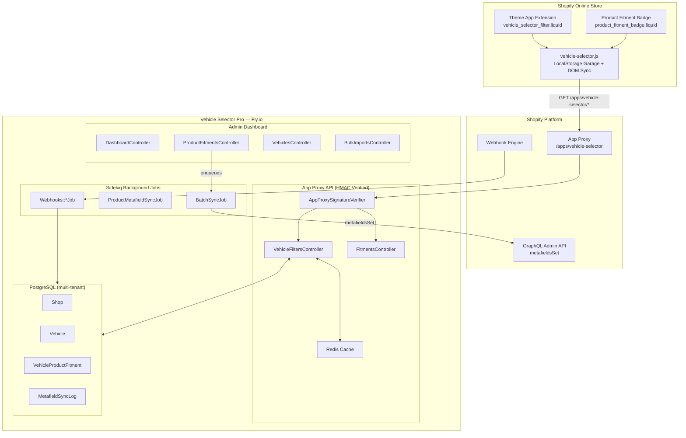
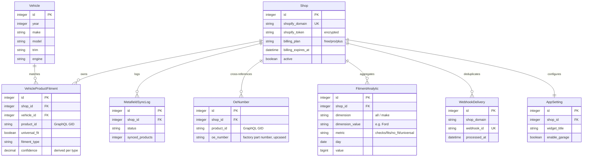

# Architecture

## System overview

## Data model

## Request flow

1. **Storefront widget** calls `/apps/vehicle-selector/years` (or `makes`, `models`, etc.)
2. **Shopify App Proxy** forwards the request with an HMAC-SHA256 signature
3. **AppProxySignatureVerifier** validates the signature using constant-time comparison
4. **VehicleFiltersController** queries the normalized PG cache (or Solid Cache for cascading trees)
5. Response cached with `Cache-Control: public, max-age=180, stale-while-revalidate=360` + a strong ETag (conditional requests return 304)
6. `check_fitment` calls additionally enqueue `RecordFitmentAnalyticJob` (low-priority queue) which aggregates daily analytics — checks/fits/no_fit overall and per make — without touching the request hot path

## Metafield sync flow

1. Merchant assigns fitment via admin dashboard
2. `after_commit` callback enqueues `BatchSyncJob` (debounced: per-product jobs coalesce in a 30s window so bulk imports don't stampede Shopify)
3. Job batches products in groups of 25
4. `metafieldsSet` GraphQL mutation writes `custom.vehicle_fitment` JSON
5. Each batch marks itself synced immediately; the sync log tracks failed counts and only `pending_sync` rows replay on retry
5. `MetafieldSyncLog` records status for the sync monitor

## Billing flow (v1.2.0+)

1. Merchant opens **Plans & billing** in the admin (`/admin/billing`)
2. Selecting a paid plan calls `Shopify::BillingService#create_subscription` → `appSubscriptionCreate` GraphQL mutation
3. The app redirects to Shopify's native `confirmationUrl` checkout
4. Shopify returns the merchant to `/admin/billing/return`
5. The controller re-queries `currentAppInstallation.activeSubscriptions` and reconciles `shops.billing_plan`
6. The shop's plan ceiling (`BillingPlan.max_fitments`) now gates bulk CSV imports

## Security layers

| Layer | Mechanism |
|---|---|
| App Proxy | HMAC-SHA256 hex signature on every request, constant-time compare |
| Webhooks | `X-Shopify-Hmac-Sha256` Base64 signature on raw body; replay dedup via `webhook_deliveries` |
| Rate limiting | Rack::Attack throttling (10 req/30s per shop) |
| Tokens | ActiveRecord Encryption at rest (`encrypts :shopify_token`) |
| Multi-tenancy | `ShopScoped` concern on every query — explicit `shop_id` scoping |
| Response headers | CSP with Shopify frame-ancestors, `X-Content-Type-Options`, referrer and permissions policy on every response |
| Dependencies | bundler-audit in CI (documented whitelist in `.bundler-audit.yml`) + Dependabot |
