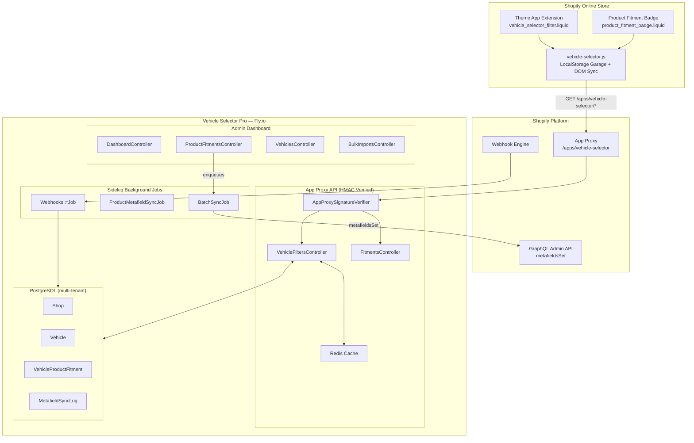
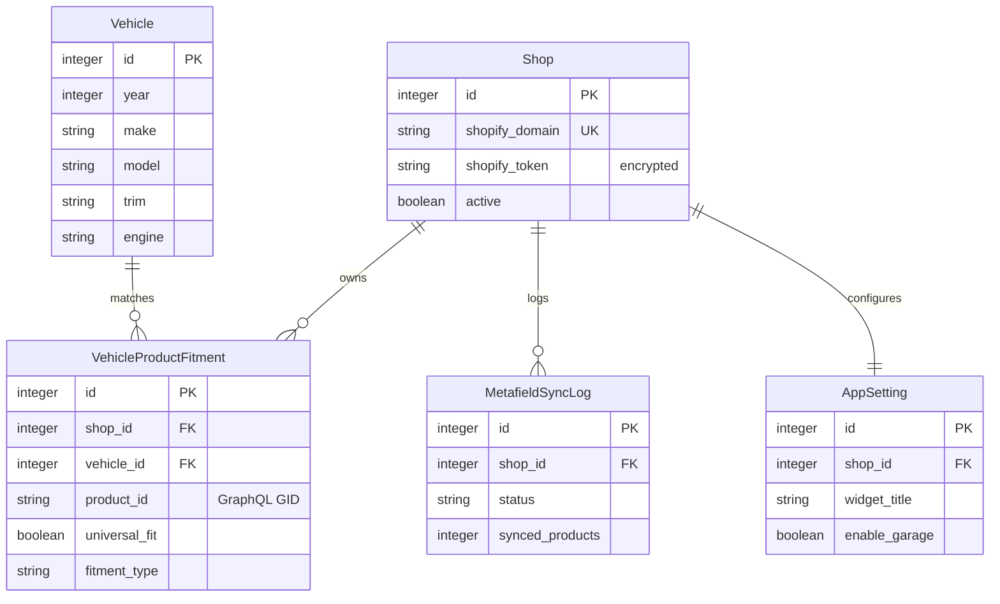

# Architecture

## System overview

## Data model

## Request flow

1. **Storefront widget** calls `/apps/vehicle-selector/years` (or `makes`, `models`, etc.)
2. **Shopify App Proxy** forwards the request with an HMAC-SHA256 signature
3. **AppProxySignatureVerifier** validates the signature using constant-time comparison
4. **VehicleFiltersController** queries the normalized PG cache (or Redis cache for cascading trees)
5. Response cached with `Cache-Control: public, max-age=180`

## Metafield sync flow

1. Merchant assigns fitment via admin dashboard
2. `after_commit` callback enqueues `BatchSyncJob`
3. Job batches products in groups of 25
4. `metafieldsSet` GraphQL mutation writes `$app.vehicle_fitment` JSON
5. `MetafieldSyncLog` records status for the sync monitor

## Security layers

| Layer | Mechanism |
|---|---|
| App Proxy | HMAC-SHA256 hex signature on every request, constant-time compare |
| Webhooks | `X-Shopify-Hmac-Sha256` Base64 signature on raw body |
| Rate limiting | Rack::Attack throttling (10 req/30s per shop) |
| Tokens | ActiveRecord Encryption at rest (`encrypts :shopify_token`) |
| Multi-tenancy | `ShopScoped` concern on every query — explicit `shop_id` scoping |
